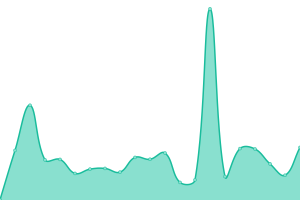

# [📈 Live Status](https://upptime.github.io/upptime): <!--live status--> **🟩 All systems operational**

This repository contains the open-source uptime monitor and status page for [Upptime](https://upptime.js.org), powered by [Upptime](https://github.com/upptime/upptime).

With [Upptime](https://upptime.js.org), you can get your own unlimited and free uptime monitor and status page, powered entirely by a GitHub repository. We use [Issues](https://github.com/upptime/upptime/issues) as incident reports, [Actions](https://github.com/gbourne1/uptime-status/actions) as uptime monitors, and [Pages](https://upptime.github.io/upptime) for the status page.

<!--start: status pages-->
<!-- This summary is generated by Upptime (https://github.com/upptime/upptime) -->
<!-- Do not edit this manually, your changes will be overwritten -->
<!-- prettier-ignore -->
| URL | Status | History | Response Time | Uptime |
| --- | ------ | ------- | ------------- | ------ |
|  [Ayrshare App](https://app.ayrshare.com) | 🟩 Up | [ayrshare-app.yml](https://github.com/ayrshare/uptime-status/commits/HEAD/history/ayrshare-app.yml) | 

 351ms
     
 | 

<a href="https://ayrshare.github.io/uptime-status/history/ayrshare-app">100.00%</a>
    

|  [Ayrshare Website](https://www.ayrshare.com) | 🟩 Up | [ayrshare-website.yml](https://github.com/ayrshare/uptime-status/commits/HEAD/history/ayrshare-website.yml) | 

 177ms
     
 | 

<a href="https://ayrshare.github.io/uptime-status/history/ayrshare-website">100.00%</a>
    

|  [/user API endpoint](https://app.ayrshare.com/api/user) | 🟩 Up | [user-api-endpoint.yml](https://github.com/ayrshare/uptime-status/commits/HEAD/history/user-api-endpoint.yml) | 

 714ms
     
 | 

<a href="https://ayrshare.github.io/uptime-status/history/user-api-endpoint">100.00%</a>
    

|  [/post Twitter API Endpoint](https://app.ayrshare.com/api/post/random) | 🟩 Up | [post-twitter-api-endpoint.yml](https://github.com/ayrshare/uptime-status/commits/HEAD/history/post-twitter-api-endpoint.yml) | 

 1182ms
     
 | 

<a href="https://ayrshare.github.io/uptime-status/history/post-twitter-api-endpoint">100.00%</a>
    

<!--end: status pages-->

[**Visit our status website →**](https://upptime.github.io/upptime)

## 📄 License

- Powered by: [Upptime](https://github.com/upptime/upptime)
- Code: [MIT](./LICENSE) © [Upptime](https://upptime.js.org)
- Data in the `./history` directory: [Open Database License](https://opendatacommons.org/licenses/odbl/1-0/)
